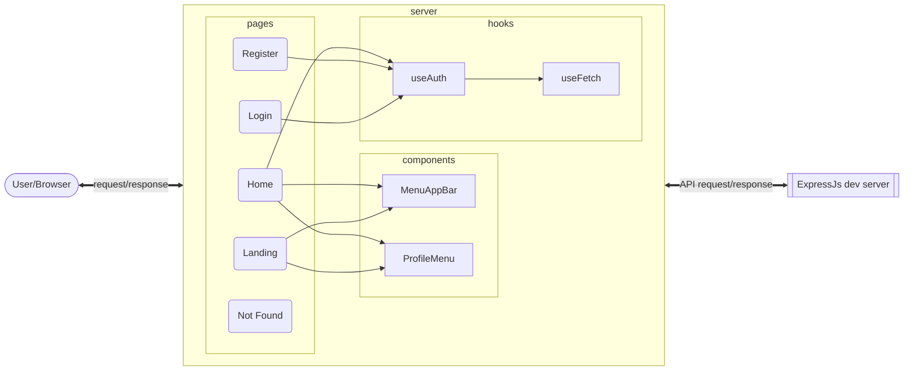
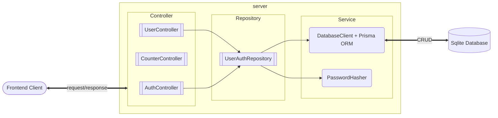
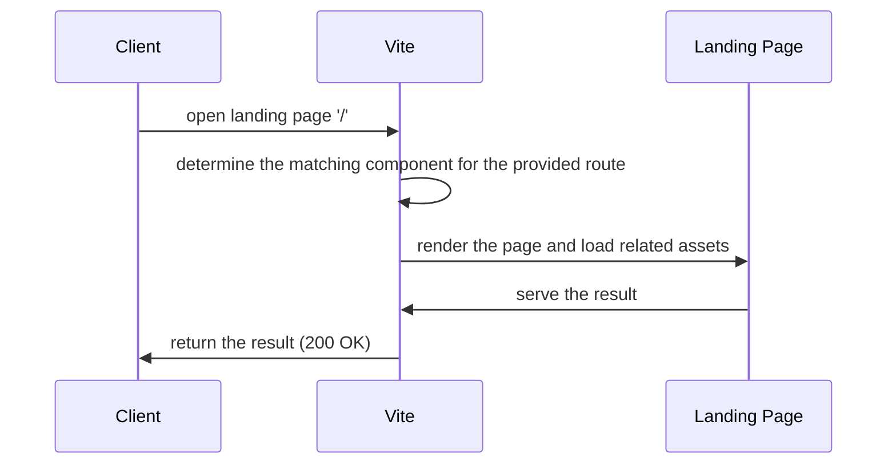
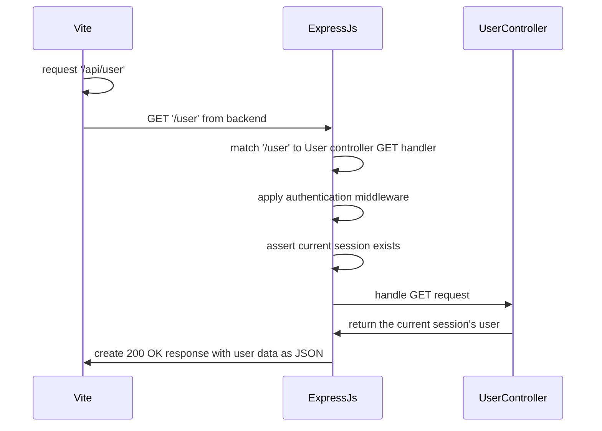

# Software Architecture

```mermaid
flowchart LR
   client([User/Browser])
   server[Vite dev server]
   api[[ExpressJs dev server]]

   subgraph server
      direction LR
      subgraph pages
         landing(Landing)
         notFound(Not Found)
         home(Home)
         login(Login)
         register(Register)
      end

      subgraph components

         MenuAppBar
         ProfileMenu
      end

      subgraph hooks
         direction LR

         useAuth
         useFetch
      end
   end


   client <== request/response ==>
   server <== API request/response ==> api

   useAuth --> useFetch

   home --> useAuth
   register --> useAuth
   login --> useAuth

   home --> MenuAppBar
   home --> ProfileMenu
   landing --> MenuAppBar
   landing --> ProfileMenu
```

```mermaid
flowchart LR

   client([Frontend Client])
   server[[ExpressJs dev server]]
   db[(Sqlite Database)]

   subgraph server
      subgraph controller[Controller]
         auth[[AuthController]]
         counter[[CounterController]]
         user[[UserController]]
      end

      subgraph service[Service]
         dbClient(DatabaseClient + Prisma ORM)
         pHasher(PasswordHasher)
      end

      subgraph repo[Repository]
         userAuthRepo[[UserAuthRepository]]
      end
   end

   client <== request/response ===> controller
   dbClient <== CRUD ===> db

   user --> userAuthRepo
   auth --> userAuthRepo

   userAuthRepo --> dbClient
   userAuthRepo --> pHasher
```

```mermaid
sequenceDiagram
   Client ->> Vite: open landing page '/'
   Vite ->> Vite: determine the matching component for the provided route
   Vite ->> Landing Page: render the page and load related assets
   Landing Page ->> Vite: serve the result
   Vite ->> Client: return the result (200 OK)
```

```mermaid
sequenceDiagram
   Vite ->> Vite: request '/api/user'
   Vite ->> ExpressJs: GET '/user' from backend
   ExpressJs ->> ExpressJs: match '/user' to User controller GET handler
   ExpressJs ->> ExpressJs: apply authentication middleware
   ExpressJs ->> ExpressJs: assert current session exists
   ExpressJs ->> UserController: handle GET request
   UserController ->> ExpressJs: return the current session's user
   ExpressJs ->> Vite: create 200 OK response with user data as JSON
```
